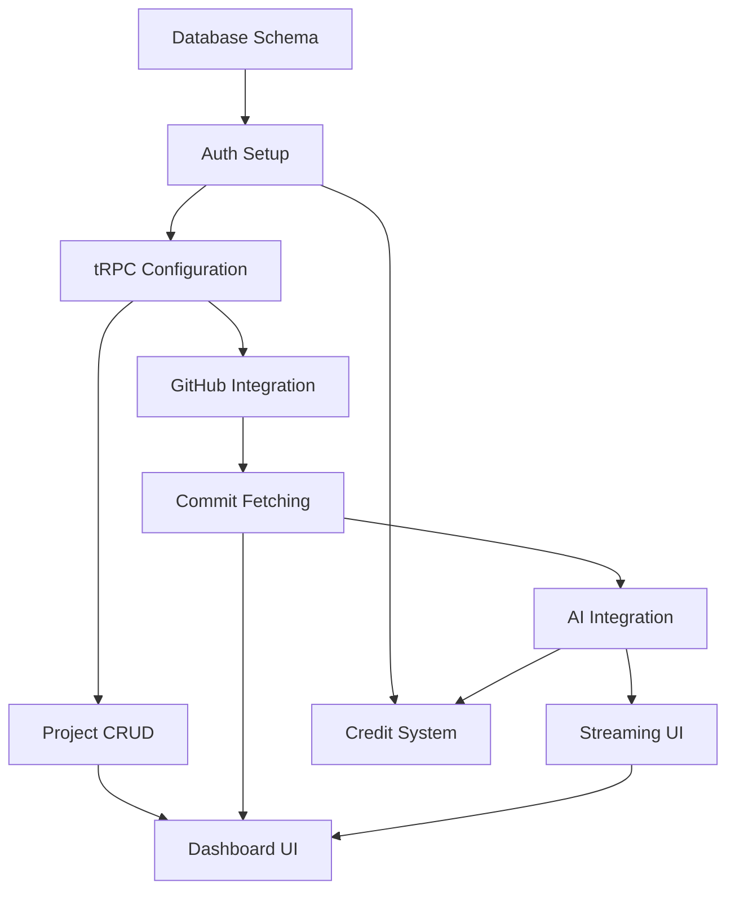

# Commit Sage - MVP Project Specifications

**Tech Lead Scope Document**
**Last Updated**: 2025-01-15
**Status**: Ready for Implementation

---

## Project Overview

**Commit Sage** is a production-ready SaaS application that analyzes GitHub repositories using AI to provide intelligent commit summaries and insights. Built with the T3 Stack (Next.js 15, tRPC, Drizzle ORM, Tailwind CSS).

### Core Value Proposition
- **Input**: GitHub repository URL
- **Process**: Fetch commits → Analyze with AI → Generate summaries
- **Output**: Beautiful dashboard with commit insights, summaries, and analytics

---

## MVP Milestone (Phase 1)

**Estimated Duration**: 4-6 weeks (2 developers)
**Total Story Points**: 83
**High Priority Items**: 7

### Definition of Done
- [ ] All code reviewed and merged
- [ ] TypeScript strict mode with zero errors
- [ ] Core user flow working: Sign up → Add repo → Analyze commits → View summaries
- [ ] Credit system functional
- [ ] Responsive UI on mobile and desktop
- [ ] Local development environment documented
- [ ] Basic error handling in place

---

## Epic 1: Infrastructure & Foundation

### Issue #1: Database Schema Implementation
**Story Points**: 5
**Labels**: backend, database, high-priority
**Priority**: P0

**Description**
Create database schema with User, Project, Commit, and CreditUsage tables using Drizzle ORM with proper indexes and relationships.

**Acceptance Criteria**
- [ ] User table with Clerk integration (id, credits, plan, stripeCustomerId)
- [ ] Project table with GitHub metadata (name, url, owner, repo)
- [ ] Commit table with AI fields (summary, aiModel, creditsUsed)
- [ ] CreditUsage log table for analytics
- [ ] All indexes created (userId, projectId, sha unique constraint)
- [ ] Table prefix `commit-sage_` implemented via createTable helper

**Technical Details**
```typescript
// src/server/db/schema.ts

// User Table (extends Clerk)
user {
  id: string              // Clerk user ID
  createdAt: timestamp
  updatedAt: timestamp
  credits: integer        // Default: 150
  plan: enum              // 'free', 'pro', 'enterprise'
  stripeCustomerId: string (optional)
}

// Project Table
project {
  id: string              // CUID
  createdAt: timestamp
  updatedAt: timestamp
  name: string
  githubUrl: string
  githubOwner: string
  githubRepo: string
  description: string (optional)
  lastSyncedAt: timestamp (optional)
  userId: string          // FK to user
  isPublic: boolean       // Default: false
}

// Commit Table
commit {
  id: string              // CUID
  createdAt: timestamp
  updatedAt: timestamp
  projectId: string       // FK to project
  sha: string             // GitHub commit hash (UNIQUE)
  message: string
  authorName: string
  authorEmail: string
  authorAvatarUrl: string (optional)
  committedAt: timestamp
  summary: string (optional)
  embedding: vector(1536) (optional)
  filesChanged: integer
  additions: integer
  deletions: integer
  aiModel: string (optional)
  creditsUsed: integer    // Default: 0
}

// Credit Usage Log
creditUsage {
  id: string              // CUID
  createdAt: timestamp
  userId: string          // FK to user
  projectId: string (optional)
  commitId: string (optional)
  amount: integer
  operation: string       // 'commit_analysis', 'insight_generation'
  model: string
}
```

**Required Indexes**
- `project.userId` - Fast user project lookups
- `commit.projectId` - Fast commit queries per project
- `commit.sha` - Prevent duplicate commits (unique constraint)
- `creditUsage.userId` - Usage analytics

---

### Issue #2: Environment Configuration & Validation
**Story Points**: 2
**Labels**: devops, configuration
**Priority**: P0

**Description**
Configure all required env vars for Clerk, GitHub, AI providers, and database with proper validation using @t3-oss/env-nextjs.

**Acceptance Criteria**
- [ ] All env vars defined in src/env.js
- [ ] Server and client schemas properly separated
- [ ] DATABASE_URL, Clerk keys, GITHUB_TOKEN configured
- [ ] AI provider keys (OpenAI, Anthropic, Google) validated
- [ ] Development and production configs documented

**Required Environment Variables**
```bash
# Database
DATABASE_URL="postgresql://..."

# Clerk Auth
NEXT_PUBLIC_CLERK_PUBLISHABLE_KEY="pk_test_..."
CLERK_SECRET_KEY="sk_test_..."
NEXT_PUBLIC_CLERK_SIGN_IN_URL="/sign-in"
NEXT_PUBLIC_CLERK_SIGN_UP_URL="/sign-up"

# GitHub
GITHUB_TOKEN="ghp_..."

# AI Providers
OPENAI_API_KEY="sk-..."
ANTHROPIC_API_KEY="sk-ant-..."
GOOGLE_GENERATIVE_AI_API_KEY="..."

# Optional: Stripe for billing
STRIPE_SECRET_KEY="sk_test_..."
STRIPE_WEBHOOK_SECRET="whsec_..."
```

---

### Issue #3: Database Setup Scripts
**Story Points**: 3
**Labels**: devops, database
**Priority**: P1

**Description**
Set up local PostgreSQL via Docker and production NeonDB with proper migration strategy.

**Acceptance Criteria**
- [ ] `./start-database.sh` script working with Docker/Podman
- [ ] `bun db:push` working for local development
- [ ] Migration files generated via `bun db:generate`
- [ ] Production migration strategy documented
- [ ] pgvector extension enabled for NeonDB

**Commands to Implement**
- `./start-database.sh` - Start local PostgreSQL
- `bun db:push` - Push schema changes (dev only)
- `bun db:generate` - Generate migrations (prod)
- `bun db:migrate` - Run migrations (prod)
- `bun db:studio` - Open Drizzle Studio

---

## Epic 2: Authentication

### Issue #4: Clerk Authentication Integration
**Story Points**: 5
**Labels**: frontend, backend, auth, high-priority
**Priority**: P0

**Description**
Set up Clerk with sign-in/sign-up pages and middleware protection.

**Acceptance Criteria**
- [ ] Clerk SDK installed and configured
- [ ] Sign-in and sign-up pages created at `/sign-in` and `/sign-up`
- [ ] Middleware protecting dashboard routes
- [ ] User context available in tRPC via `ctx.userId`
- [ ] `protectedProcedure` implemented in tRPC

**Technical Implementation**
```typescript
// src/middleware.ts
import { clerkMiddleware } from "@clerk/nextjs/server";

export default clerkMiddleware();

// src/server/api/trpc.ts
import { auth } from "@clerk/nextjs/server";

export const createTRPCContext = async (opts: { headers: Headers }) => {
  const session = await auth();
  return {
    db,
    userId: session?.userId ?? null,
  };
};

export const protectedProcedure = publicProcedure.use(({ ctx, next }) => {
  if (!ctx.userId) {
    throw new TRPCError({ code: "UNAUTHORIZED" });
  }
  return next({
    ctx: {
      userId: ctx.userId, // Non-null userId guaranteed
    },
  });
});
```

**File Structure**
```
src/app/
├── (auth)/
│   ├── sign-in/[[...sign-in]]/page.tsx
│   └── sign-up/[[...sign-up]]/page.tsx
```

---

### Issue #5: User Model & Clerk Sync
**Story Points**: 3
**Labels**: backend, auth
**Priority**: P1

**Description**
Create user records in database when users sign up via Clerk.

**Acceptance Criteria**
- [ ] User created in DB on first Clerk sign-in
- [ ] Default 150 credits assigned
- [ ] Plan set to 'free' by default
- [ ] User profile accessible via tRPC

**Implementation Pattern**
```typescript
// Check if user exists, if not create
const user = await db.query.user.findFirst({
  where: eq(userTable.id, ctx.userId),
});

if (!user) {
  await db.insert(userTable).values({
    id: ctx.userId,
    credits: 150,
    plan: 'free',
  });
}
```

---

## Epic 3: GitHub Integration

### Issue #6: GitHub OAuth & Repository Access
**Story Points**: 5
**Labels**: backend, integration, high-priority
**Priority**: P0

**Description**
Set up GitHub OAuth flow to allow users to connect their GitHub accounts.

**Acceptance Criteria**
- [ ] GitHub OAuth app configured
- [ ] OAuth flow implemented in Clerk
- [ ] GitHub access token stored securely
- [ ] Support for public repo access without OAuth

**OAuth Configuration**
- Configure GitHub OAuth app in GitHub Developer Settings
- Add GitHub as OAuth provider in Clerk dashboard
- Store user's GitHub token securely (encrypted in DB or Clerk metadata)

---

### Issue #7: Octokit Client & Commit Fetching
**Story Points**: 5
**Labels**: backend, integration
**Priority**: P0

**Description**
Implement Octokit client with rate limiting and commit fetching functionality.

**Acceptance Criteria**
- [ ] Octokit client configured with GITHUB_TOKEN
- [ ] `fetchRecentCommits()` function in `src/lib/github/commits.ts`
- [ ] Rate limit handling (5000 req/hour with auth)
- [ ] Commit metadata extraction (sha, message, author, stats)
- [ ] Error handling for invalid repos

**Technical Implementation**
```typescript
// src/lib/github/commits.ts
import { Octokit } from "octokit";

const octokit = new Octokit({
  auth: process.env.GITHUB_TOKEN,
});

export async function fetchRecentCommits(owner: string, repo: string) {
  const { data } = await octokit.rest.repos.listCommits({
    owner,
    repo,
    per_page: 100,
  });

  return data.map((commit) => ({
    sha: commit.sha,
    message: commit.commit.message,
    authorName: commit.commit.author?.name,
    authorEmail: commit.commit.author?.email,
    authorAvatarUrl: commit.author?.avatar_url,
    committedAt: new Date(commit.commit.author?.date),
    filesChanged: commit.files?.length ?? 0,
    additions: commit.stats?.additions ?? 0,
    deletions: commit.stats?.deletions ?? 0,
  }));
}
```

**Rate Limits**
- Unauthenticated: 60 requests/hour
- Authenticated with personal token: 5,000 requests/hour
- Always use `GITHUB_TOKEN` for API calls

---

### Issue #8: Project CRUD via tRPC
**Story Points**: 3
**Labels**: backend, api
**Priority**: P1

**Description**
Implement project creation, listing, and deletion via tRPC.

**Acceptance Criteria**
- [ ] `projectRouter` in `src/server/api/routers/project.ts`
- [ ] `create` mutation with GitHub URL parsing
- [ ] `list` query with user filtering
- [ ] `delete` mutation with cascade delete of commits
- [ ] Input validation with Zod

**API Endpoints**
```typescript
// src/server/api/routers/project.ts
export const projectRouter = createTRPCRouter({
  create: protectedProcedure
    .input(z.object({
      githubUrl: z.string().url(),
    }))
    .mutation(async ({ ctx, input }) => {
      const [owner, repo] = parseGitHubUrl(input.githubUrl);

      const project = await ctx.db.insert(projectTable).values({
        userId: ctx.userId,
        name: repo,
        githubUrl: input.githubUrl,
        githubOwner: owner,
        githubRepo: repo,
      }).returning();

      return project[0];
    }),

  list: protectedProcedure.query(async ({ ctx }) => {
    return ctx.db.query.project.findMany({
      where: eq(projectTable.userId, ctx.userId),
      orderBy: desc(projectTable.createdAt),
    });
  }),

  delete: protectedProcedure
    .input(z.object({ id: z.string() }))
    .mutation(async ({ ctx, input }) => {
      // Cascade delete commits
      await ctx.db.delete(commitTable)
        .where(eq(commitTable.projectId, input.id));

      await ctx.db.delete(projectTable)
        .where(and(
          eq(projectTable.id, input.id),
          eq(projectTable.userId, ctx.userId)
        ));
    }),
});
```

---

## Epic 4: AI Integration

### Issue #9: AI Provider Configuration
**Story Points**: 3
**Labels**: backend, ai, high-priority
**Priority**: P0

**Description**
Configure OpenAI, Anthropic, and Google AI providers with fallback strategy.

**Acceptance Criteria**
- [ ] AI SDK installed (`ai` package)
- [ ] Provider configs in `src/lib/ai/providers.ts`
- [ ] Model selection logic (`getModelForTask()`)
- [ ] GPT-4o-mini for commits, GPT-4o for insights
- [ ] Fallback to Claude and Gemini

**Technical Implementation**
```typescript
// src/lib/ai/providers.ts
import { anthropic } from "@ai-sdk/anthropic";
import { openai } from "@ai-sdk/openai";
import { google } from "@ai-sdk/google";

export const AI_MODELS = {
  primary: openai("gpt-4o"),
  fast: openai("gpt-4o-mini"),
  fallback: anthropic("claude-3-5-sonnet-20241022"),
  budget: google("gemini-2.0-flash-exp"),
} as const;

export const getModelForTask = (task: "commit" | "insight" | "chat") => {
  switch (task) {
    case "commit":
      return AI_MODELS.fast; // GPT-4o-mini
    case "insight":
      return AI_MODELS.primary; // GPT-4o
    case "chat":
      return AI_MODELS.fast;
    default:
      return AI_MODELS.fast;
  }
};
```

**Required Packages**
```bash
bun add ai @ai-sdk/openai @ai-sdk/anthropic @ai-sdk/google
```

---

### Issue #10: Commit Summarization with Streaming
**Story Points**: 8
**Labels**: backend, ai, high-priority
**Priority**: P0

**Description**
Create Server Action to analyze commits using AI with streaming UI updates.

**Acceptance Criteria**
- [ ] Server Action for `analyzeCommitStream()`
- [ ] Streaming text using `streamText()` from AI SDK
- [ ] Commit diff analysis with GPT-4o-mini
- [ ] Summary stored in database
- [ ] Token usage tracked
- [ ] Credits deducted per analysis

**Technical Implementation**
```typescript
// src/app/actions/analyze-commit.ts
"use server";

import { streamText } from "ai";
import { createStreamableValue } from "ai/rsc";
import { getModelForTask } from "@/lib/ai/providers";

export async function analyzeCommitStream(
  commitId: string,
  commitDiff: string
) {
  const stream = createStreamableValue("");

  (async () => {
    const { textStream, usage } = await streamText({
      model: getModelForTask("commit"),
      prompt: `Analyze this commit and provide a concise summary:\n\n${commitDiff}`,
    });

    for await (const delta of textStream) {
      stream.update(delta);
    }

    stream.done();

    // Save to database
    await saveCommitSummary(commitId, stream.value, usage);
  })();

  return { output: stream.value };
}
```

**Note**: AI streaming must use Server Actions or Route Handlers, **not tRPC** (tRPC doesn't support streaming responses).

---

### Issue #11: AI Prompts for Commit Analysis
**Story Points**: 2
**Labels**: ai, content
**Priority**: P1

**Description**
Create effective prompts that generate high-quality commit summaries.

**Acceptance Criteria**
- [ ] Prompt templates in `src/lib/ai/prompts.ts`
- [ ] Focus on "why" not "what"
- [ ] Include context about file changes
- [ ] Concise 1-2 sentence summaries
- [ ] Code quality and impact analysis

**Prompt Template**
```typescript
// src/lib/ai/prompts.ts
export const COMMIT_ANALYSIS_PROMPT = `
You are a senior software engineer reviewing code commits.

Analyze the following commit and provide a concise summary that explains:
1. WHY the change was made (the purpose/motivation)
2. The IMPACT of the change (what problem it solves)
3. Any notable technical decisions

Keep your summary to 1-2 sentences. Focus on insights, not just describing what changed.

Commit Details:
{commit_details}
`;
```

---

## Epic 5: UI/UX

### Issue #12: Dashboard Layout & Navigation
**Story Points**: 5
**Labels**: frontend, ui, high-priority
**Priority**: P0

**Description**
Create responsive dashboard layout using shadcn/ui components.

**Acceptance Criteria**
- [ ] Dashboard layout in `src/app/(dashboard)/layout.tsx`
- [ ] Sidebar with navigation links
- [ ] Dark/light mode support via next-themes
- [ ] Responsive design for mobile
- [ ] User profile dropdown

**File Structure**
```
src/app/(dashboard)/
├── layout.tsx          # Dashboard layout with sidebar
├── page.tsx            # Projects overview
├── [projectId]/        # Individual project pages
├── billing/            # Subscription management
└── settings/           # User settings
```

**Components Needed**
- Sidebar navigation
- Header with user dropdown
- Theme toggle
- Mobile menu

---

### Issue #13: Projects Overview Page
**Story Points**: 5
**Labels**: frontend, ui
**Priority**: P0

**Description**
Display all user projects with create/delete actions.

**Acceptance Criteria**
- [ ] Projects list at `src/app/(dashboard)/page.tsx`
- [ ] "Add Project" button with GitHub URL input
- [ ] Project cards with metadata
- [ ] Delete confirmation modal
- [ ] Loading and error states

**UI Components**
- Project card component
- Add project dialog
- Delete confirmation dialog
- Empty state for no projects

**tRPC Integration**
```typescript
const { data: projects, isLoading } = api.project.list.useQuery();
const createProject = api.project.create.useMutation();
const deleteProject = api.project.delete.useMutation();
```

---

### Issue #14: Project Dashboard Page
**Story Points**: 5
**Labels**: frontend, ui
**Priority**: P0

**Description**
Show project details, recent commits, and quick stats.

**Acceptance Criteria**
- [ ] Project page at `src/app/(dashboard)/[projectId]/page.tsx`
- [ ] Project header with GitHub link
- [ ] Recent commits list preview
- [ ] Stats: total commits, analyzed commits, credits used
- [ ] "Sync Commits" button

**Stats to Display**
- Total commits
- Analyzed commits
- Credits used
- Last synced date
- GitHub stars/forks (optional)

---

### Issue #15: Commits List & Detail View
**Story Points**: 8
**Labels**: frontend, ui
**Priority**: P0

**Description**
Display paginated commit list with filtering and detail view.

**Acceptance Criteria**
- [ ] Commits list at `src/app/(dashboard)/[projectId]/commits/page.tsx`
- [ ] Pagination with TanStack Query
- [ ] AI summary display with streaming indicator
- [ ] Author avatars and metadata
- [ ] "Analyze with AI" button for unanalyzed commits
- [ ] Real-time streaming UI updates

**UI Components**
- Commit list item component
- Pagination controls
- Filter controls (date range, author)
- Streaming text component
- Loading skeletons

**Features**
- Infinite scroll or pagination
- Filter by author
- Filter by date range
- Sort by date/author
- Real-time AI streaming

---

### Issue #16: shadcn/ui Component Setup
**Story Points**: 2
**Labels**: frontend, ui
**Priority**: P0

**Description**
Set up shadcn/ui with Tailwind CSS 4 and required components.

**Acceptance Criteria**
- [ ] shadcn/ui initialized
- [ ] Components: Button, Card, Dialog, Table, Tabs, Badge
- [ ] Tailwind config with design tokens
- [ ] Lucide icons installed
- [ ] Dark mode support configured

**Components to Install**
```bash
npx shadcn-ui@latest init
npx shadcn-ui@latest add button
npx shadcn-ui@latest add card
npx shadcn-ui@latest add dialog
npx shadcn-ui@latest add table
npx shadcn-ui@latest add tabs
npx shadcn-ui@latest add badge
npx shadcn-ui@latest add dropdown-menu
npx shadcn-ui@latest add input
npx shadcn-ui@latest add label
npx shadcn-ui@latest add skeleton
npx shadcn-ui@latest add toast
```

---

## Epic 6: API & Business Logic

### Issue #17: tRPC Setup & Configuration
**Story Points**: 3
**Labels**: backend, api, high-priority
**Priority**: P0

**Description**
Set up server and client tRPC instances with proper typing.

**Acceptance Criteria**
- [ ] Server tRPC in `src/trpc/server.ts`
- [ ] Client tRPC in `src/trpc/react.tsx`
- [ ] React Query integration
- [ ] SuperJSON transformer
- [ ] Development timing middleware
- [ ] Root router in `src/server/api/root.ts`

**File Structure**
```
src/
├── trpc/
│   ├── react.tsx           # Client-side tRPC provider
│   ├── server.ts           # Server-side tRPC caller
│   └── query-client.ts     # React Query configuration
└── server/api/
    ├── trpc.ts             # tRPC config, procedures, middleware
    └── root.ts             # Main router aggregation
```

**Key Features**
- Dual-client architecture (server RSC + client)
- Type-safe API calls
- React Query integration
- SuperJSON for Date handling
- Development timing middleware

---

### Issue #18: Commit Analysis tRPC Router
**Story Points**: 5
**Labels**: backend, api
**Priority**: P0

**Description**
Build tRPC endpoints for commit operations.

**Acceptance Criteria**
- [ ] `commitRouter` in `src/server/api/routers/commit.ts`
- [ ] `list` query with pagination
- [ ] `syncFromGitHub` mutation to fetch new commits
- [ ] `analyze` mutation triggering AI summarization
- [ ] Credit check before analysis
- [ ] Duplicate prevention via SHA constraint

**API Endpoints**
```typescript
export const commitRouter = createTRPCRouter({
  list: protectedProcedure
    .input(z.object({
      projectId: z.string(),
      limit: z.number().default(50),
      offset: z.number().default(0),
    }))
    .query(async ({ ctx, input }) => {
      return ctx.db.query.commit.findMany({
        where: eq(commitTable.projectId, input.projectId),
        limit: input.limit,
        offset: input.offset,
        orderBy: desc(commitTable.committedAt),
      });
    }),

  syncFromGitHub: protectedProcedure
    .input(z.object({ projectId: z.string() }))
    .mutation(async ({ ctx, input }) => {
      const project = await getProject(input.projectId);
      const commits = await fetchRecentCommits(
        project.githubOwner,
        project.githubRepo
      );

      // Insert commits (ignore duplicates via SHA constraint)
      await insertCommits(commits, input.projectId);
    }),

  analyze: protectedProcedure
    .input(z.object({ commitId: z.string() }))
    .mutation(async ({ ctx, input }) => {
      // Check credits first
      await checkUserCredits(ctx.userId, COST_PER_COMMIT);

      // Trigger AI analysis (via Server Action)
      // Note: Cannot stream via tRPC, must use Server Action
    }),
});
```

---

### Issue #19: Credit System Implementation
**Story Points**: 5
**Labels**: backend, billing
**Priority**: P1

**Description**
Build credit management system with transaction safety.

**Acceptance Criteria**
- [ ] Credit check before AI operations
- [ ] Atomic credit deduction using transactions
- [ ] CreditUsage log entries
- [ ] User credit balance in UI
- [ ] "Insufficient credits" error handling
- [ ] Cost constants (1 credit per commit analysis)

**Technical Implementation**
```typescript
// Constants
export const COST_PER_COMMIT = 1;
export const COST_PER_INSIGHT = 5;

// Credit check
async function checkUserCredits(userId: string, cost: number) {
  const user = await db.query.user.findFirst({
    where: eq(userTable.id, userId),
    columns: { credits: true },
  });

  if (!user || user.credits < cost) {
    throw new TRPCError({
      code: "FORBIDDEN",
      message: "Insufficient credits",
    });
  }
}

// Credit deduction (with transaction)
async function deductCredits(
  userId: string,
  cost: number,
  operation: string,
  metadata: { projectId?: string; commitId?: string; model: string }
) {
  await db.transaction(async (tx) => {
    // Deduct credits
    await tx
      .update(userTable)
      .set({ credits: sql`${userTable.credits} - ${cost}` })
      .where(eq(userTable.id, userId));

    // Log usage
    await tx.insert(creditUsageTable).values({
      userId,
      amount: cost,
      operation,
      ...metadata,
    });
  });
}
```

---

## Epic 7: Testing & Quality

### Issue #20: TypeScript Strict Mode Configuration
**Story Points**: 2
**Labels**: devops, quality
**Priority**: P1

**Description**
Configure and fix all TypeScript strict mode issues.

**Acceptance Criteria**
- [ ] `strict: true` in tsconfig
- [ ] `noUncheckedIndexedAccess: true`
- [ ] Zero TypeScript errors
- [ ] Proper null/undefined handling
- [ ] Type-safe tRPC calls

**tsconfig.json Settings**
```json
{
  "compilerOptions": {
    "strict": true,
    "noUncheckedIndexedAccess": true,
    "strictNullChecks": true,
    "strictFunctionTypes": true,
    "strictBindCallApply": true,
    "strictPropertyInitialization": true,
    "noImplicitThis": true,
    "alwaysStrict": true
  }
}
```

---

### Issue #21: Error Handling & Loading States
**Story Points**: 3
**Labels**: frontend, backend, quality
**Priority**: P1

**Description**
Add error boundaries, toast notifications, and loading states.

**Acceptance Criteria**
- [ ] Error boundaries in app layout
- [ ] Toast notifications for errors
- [ ] Loading skeletons for async operations
- [ ] tRPC error formatting
- [ ] GitHub API error handling
- [ ] AI provider fallback on errors

**Components to Implement**
- Error boundary component
- Toast notification system
- Loading skeleton components
- Error message formatter

**Error Handling Strategy**
- tRPC errors: Display user-friendly messages
- GitHub API errors: Handle rate limits, invalid repos
- AI provider errors: Fallback to alternative models
- Database errors: Transaction rollback

---

## Technical Dependencies



---

## Priority Roadmap

### Sprint 1 (Week 1-2): Foundation
**Goal**: Database, Auth, tRPC working

1. Issue #1: Database Schema (P0)
2. Issue #2: Environment Config (P0)
3. Issue #3: Database Scripts (P1)
4. Issue #4: Clerk Auth (P0)
5. Issue #17: tRPC Setup (P0)

**Deliverable**: User can sign up, auth works, database ready

---

### Sprint 2 (Week 2-3): GitHub Integration
**Goal**: Fetch and display commits

6. Issue #6: GitHub OAuth (P0)
7. Issue #7: Octokit Client (P0)
8. Issue #8: Project CRUD (P1)
9. Issue #18: Commit Router (P0)
10. Issue #16: shadcn/ui Setup (P0)

**Deliverable**: User can add repos and see commits

---

### Sprint 3 (Week 3-4): AI Features
**Goal**: AI summarization working

11. Issue #9: AI Provider Config (P0)
12. Issue #10: Commit Summarization (P0)
13. Issue #11: AI Prompts (P1)
14. Issue #19: Credit System (P1)

**Deliverable**: AI analysis of commits working

---

### Sprint 4 (Week 4-6): UI Polish
**Goal**: Complete user experience

15. Issue #12: Dashboard Layout (P0)
16. Issue #13: Projects Page (P0)
17. Issue #14: Project Dashboard (P0)
18. Issue #15: Commits List (P0)
19. Issue #5: User Sync (P1)
20. Issue #20: TypeScript Strict (P1)
21. Issue #21: Error Handling (P1)

**Deliverable**: MVP complete, ready for users

---

## Success Metrics

### Technical Metrics
- Zero TypeScript errors in strict mode
- < 3 second page load time
- < 100ms tRPC response time (p95)
- 99% uptime for AI analysis

### Product Metrics
- User can complete signup → analyze commits in < 5 minutes
- AI summaries generated in < 10 seconds
- Credit system tracks usage accurately
- Responsive design works on mobile

### User Flow
1. Sign up with Clerk
2. Add GitHub repository URL
3. System fetches commits automatically
4. User clicks "Analyze with AI" on a commit
5. Streaming summary appears in real-time
6. Credits deducted automatically
7. User views all analyzed commits

---

## Risk Mitigation

### High-Risk Items
1. **GitHub Rate Limits**: Use authenticated requests, implement caching
2. **AI Provider Costs**: Start with GPT-4o-mini, implement fallbacks
3. **Streaming Complexity**: Use Server Actions, not tRPC
4. **Credit Race Conditions**: Use database transactions

### Mitigation Strategies
- Implement comprehensive error handling early
- Use feature flags for risky features
- Set up monitoring and alerting
- Implement AI provider fallbacks from day 1

---

## Post-MVP Features (Future Phases)

### Phase 2: Credits & Billing
- Stripe integration for credit purchases
- Usage analytics dashboard
- Subscription plans (Pro, Enterprise)

### Phase 3: Enhanced AI Features
- Insight generation (trends, patterns)
- Multi-commit analysis
- Chat with repository (RAG)

### Phase 4: Vector Search
- Generate embeddings for commits
- Semantic search across commits
- "Find similar changes" feature

### Phase 5: Polish & Deploy
- Landing page with marketing copy
- SEO optimization
- Performance optimization
- Deploy to Vercel

---

## Team Structure

**Recommended Team**
- 1 Full-stack engineer (Backend + Database)
- 1 Frontend engineer (UI/UX + tRPC integration)
- 1 Tech Lead (Architecture + Code review)

**Responsibilities**
- Backend: Database, tRPC, GitHub API, Credit system
- Frontend: Dashboard UI, Streaming components, shadcn/ui
- AI Integration: Shared between backend and frontend
- DevOps: Shared, Vercel deployment

---

**Document Version**: 1.0
**Last Updated**: 2025-01-15
**Status**: Ready for Linear Import
